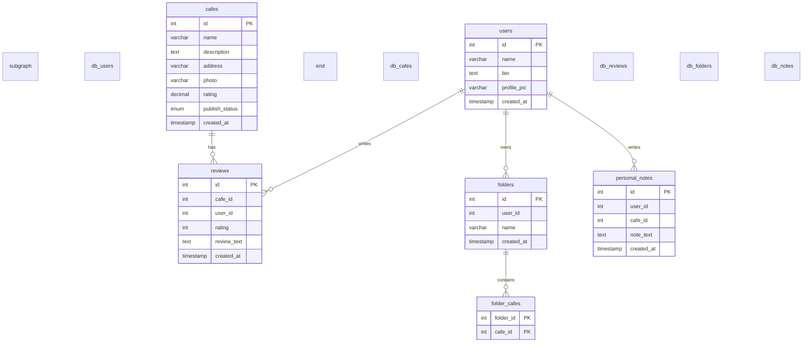

# Smart Place Finder ☕📍

**Smart Place Finder** adalah aplikasi berbasis web yang dirancang secara modern untuk mencatat, mengelola, dan mereview cafe yang pernah dikunjungi, serta membagikan ulasan tersebut ke publik setelah melewati tahap persetujuan admin (moderasi). 

Proyek ini dibangun menggunakan arsitektur **API Gateway (GraphQL)** dan infrastruktur **Docker Containerization** untuk memisahkan domain data ke dalam beberapa basis data terisolasi guna mensimulasikan lingkungan microservices yang mandiri dan berintegritas tinggi.

---

## 🛠️ Arsitektur & Teknologi Sistem

Aplikasi ini mengadopsi standar pengembangan modular end-to-end:

*   **Backend:** Node.js, Express.js.
*   **API Gateway:** GraphQL (menggunakan `@apollo/server` dan middleware Express).
*   **Database (Strict Isolation):** MySQL 8.0 (berjalan di dalam container terpisah dengan 5 database independen):
    *   `db_users` (untuk profil pengguna)
    *   `db_cafes` (untuk data cafe utama dan status publikasi)
    *   `db_reviews` (untuk rating dan review pengguna)
    *   `db_folders` (untuk folder favorit pengguna)
    *   `db_notes` (untuk catatan pribadi pengguna yang terisolasi)
*   **Frontend Client:** Single Page Application (SPA) menggunakan HTML5 Semantik, Vanilla JavaScript (Fetch API), dan **Tailwind CSS via CDN** dengan tipografi **Plus Jakarta Sans / Outfit**.
*   **Infrastruktur:** Docker & Docker Compose untuk orkestrasi container dan volume persisten.

---

## 📂 Struktur Folder Proyek

```
Smart-Place-Finder/
├── backend/
│   ├── public/
│   │   └── index.html        # Frontend Client SPA (Tailwind CSS & Vanilla JS)
│   ├── src/
│   │   ├── config/
│   │   │   └── db.js            # Inisialisasi pool koneksi MySQL (5 database)
│   │   ├── schema/
│   │   │   ├── typeDefs/        # Modular GraphQL Type Definitions (schema)
│   │   │   │   ├── base.js
│   │   │   │   ├── user.js
│   │   │   │   ├── cafe.js
│   │   │   │   ├── review.js
│   │   │   │   ├── folder.js
│   │   │   │   ├── note.js
│   │   │   │   └── index.js
│   │   │   └── resolvers/       # Modular GraphQL Business Logic (resolvers)
│   │   │       ├── user.js
│   │   │       ├── cafe.js
│   │   │       ├── review.js
│   │   │       ├── folder.js
│   │   │       ├── note.js
│   │   │       └── index.js
│   │   └── index.js             # Entrypoint server Express & Apollo Server
│   ├── .dockerignore            # Exclude node_modules dan file lokal
│   ├── .env                     # Variabel lingkungan aktif untuk database
│   ├── .env.example             # Template variabel lingkungan
│   └── Dockerfile               # Konfigurasi container image backend Node.js
├── db-init/
│   └── init.sql                 # Script inisialisasi skema DDL & Seed data MySQL
├── docker-compose.yml           # Orkestrasi Docker container (backend & db)
├── .gitignore                   # Aturan pengabaian file Git
├── DESIGN.md                    # Panduan desain & UI/UX tokens
├── PRD.md                       # Product Requirements Document
└── README.md                    # Dokumentasi teknis proyek (berkas ini)
```

---

## 💾 Desain ERD & Skema Database

Untuk mendukung isolasi data, MySQL diinisialisasi secara otomatis oleh script `init.sql` dengan membagi tabel-tabel ke dalam database masing-masing:



*Hubungan relasional antara entitas di atas dijaga dan diresolusi secara dinamis di tingkat API Gateway (GraphQL resolvers).*

---

## ⚡ Prasyarat & Cara Instalasi

Ikuti langkah-langkah di bawah untuk menjalankan aplikasi secara instan:

### 1. Prasyarat
Pastikan Anda telah memasang perangkat lunak berikut:
*   [Docker Desktop](https://www.docker.com/products/docker-desktop/) (pastikan daemon Docker dalam keadaan berjalan).
*   Port host `4000` (backend) dan `3307` (database) dalam keadaan kosong/tidak terpakai.

### 2. Menjalankan Aplikasi
1.  Buka terminal atau PowerShell pada root folder proyek (`Smart-Place-Finder`).
2.  Jalankan perintah berikut untuk mengunduh image, membangun container, dan menjalankan service:
    ```powershell
    docker-compose up --build -d
    ```
3.  Tunggu hingga container database MySQL melakukan inisiasi tabel dan seeding data secara otomatis. Anda dapat memantau status kesehatan container dengan perintah `docker-compose ps`.
4.  Setelah status database menjadi **healthy**, akses aplikasi melalui browser:
    *   **Dashboard SPA Client:** `http://localhost:4000/`
    *   **GraphQL Playground:** `http://localhost:4000/graphql`
    *   **REST Health Check:** `http://localhost:4000/health`

### 3. Menghentikan Aplikasi
Untuk menghentikan container beserta seluruh volumenya, jalankan:
```powershell
docker-compose down -v
```

---

## 🔍 Panduan Pengujian & Payload API

Berikut adalah beberapa payload kueri dan mutasi GraphQL yang dapat dieksekusi di **GraphQL Playground** (`http://localhost:4000/graphql`) atau Postman untuk memvalidasi fungsionalitas sistem:

### 1. Manajemen Cafe & Admin Review System

*   **Mutation `createCafe` (Registrasi cafe baru - status otomatis PENDING):**
    ```graphql
    mutation {
      createCafe(
        name: "Morning Glory Coffee"
        description: "Tempat tenang dengan hembusan angin sejuk"
        address: "Jl. Diponegoro No. 12, Bandung"
        photo: "https://images.unsplash.com/photo-1498804103079-a6351b050096?w=500"
        rating: 4.5
        review: "Kopinya enak sekali, layanannya cepat!"
      ) {
        id
        name
        publishStatus
        rating
      }
    }
    ```

*   **Query `getPendingCafes` (Mendapatkan antrean moderasi admin):**
    ```graphql
    query {
      getPendingCafes {
        id
        name
        publishStatus
      }
    }
    ```

*   **Mutation `updateCafePublishStatus` (Menyetujui cafe oleh admin):**
    ```graphql
    mutation {
      updateCafePublishStatus(id: "4", publishStatus: APPROVED) {
        id
        name
        publishStatus
      }
    }
    ```

*   **Query `getCafes` (Mendapatkan seluruh cafe berstatus APPROVED beserta ulasannya):**
    ```graphql
    query {
      getCafes {
        id
        name
        rating
        publishStatus
        reviews {
          id
          rating
          reviewText
          user {
            name
          }
        }
      }
    }
    ```

### 2. Rating & Review (Kalkulasi Rating Dinamis)

*   **Mutation `addReview` (Menambahkan review baru dan menghitung ulang rata-rata rating cafe):**
    ```graphql
    mutation {
      addReview(
        cafeId: "2"
        userId: "1"
        rating: 5
        reviewText: "Tempat WFH terbaik, WiFi-nya kencang sekali!"
      ) {
        id
        rating
        reviewText
        cafe {
          id
          name
          rating
        }
      }
    }
    ```

### 3. Folder Favorit (Penyimpanan Mappings)

*   **Query `getUserFolders` (Mendapatkan folder favorit user dan cafe di dalamnya):**
    ```graphql
    query {
      getUserFolders(userId: "1") {
        id
        name
        cafes {
          id
          name
          address
        }
      }
    }
    ```

### 4. Personal Notes (Catatan Pribadi yang Terisolasi)

*   **Mutation `addPersonalNote` (Menambahkan catatan privat):**
    ```graphql
    mutation {
      addPersonalNote(
        userId: "1"
        cafeId: "2"
        noteText: "WiFi pass: kopi_kenangan123. Meja dekat colokan ada di lantai 2."
      ) {
        id
        noteText
      }
    }
    ```

*   **Query `getCafeById` (Mengambil detail cafe dan catatan pribadi terisolasi per user):**
    ```graphql
    query {
      getCafeById(id: "2") {
        id
        name
        personalNotes(userId: "1") {
          id
          noteText
        }
      }
    }
    ```
